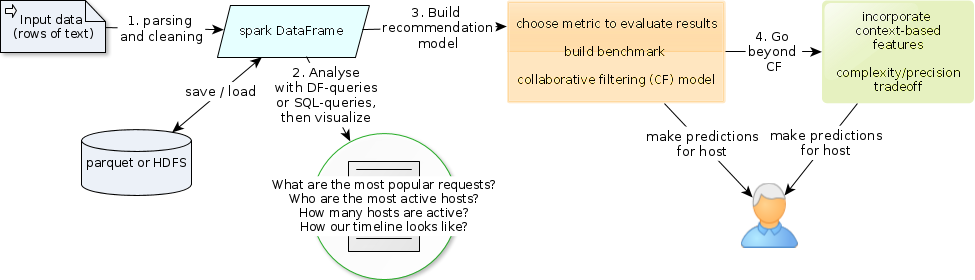
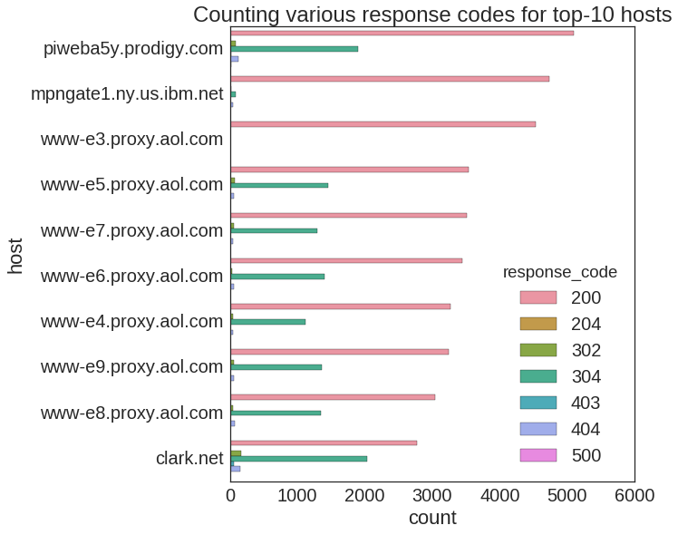
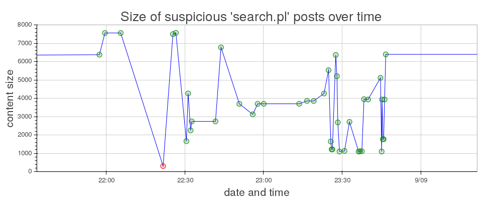
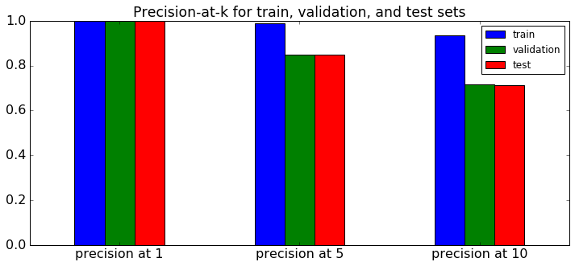
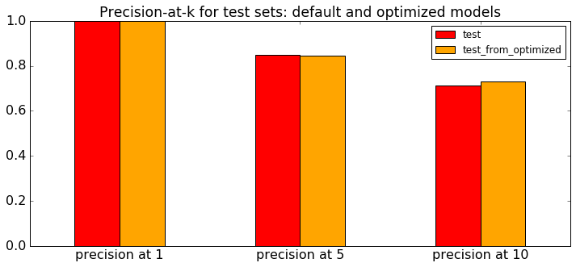

# ClarkNet-Recommendations

##### Parsing (including incorrectly formated strings), analysis and recommendations for web-pages based on the web server log data

The data are taken from here. The code assumes that the file "clarknet_access_log_Sep4 .gz" is downloaded, gunziped and put into "data" subdirectory.
The lines may look like
ix-dc9-19.ix.netcom.com - - [04/Sep/1995:00:00:28 -0400] "GET /html/cgi.html HTTP/1.0" 200 2217 (normal line)
s211-177.qns.com - - [04/Sep/1995:00:00:28 -0400] "GET /pub/ sshay/ interact.html HTTP/1.0" 200 2541 (several words in request)
whidbey.whidbey.com - - [04/Sep/1995:00:25:30 -0400] "GET /pub/sshay/images/greysped.gif" 200 4542 (no protocol info)

1. [Parsing and cleaning](https://rawgit.com/olalakul/ClarkNet-Recommend-Webpages/master/1-Clarknet-Cleaning.html)

2. [Exploratory Data Analysis and Visualizations](https://rawgit.com/olalakul/ClarkNet-Recommend-Webpages/master/2-Clarknet-Analysis.html)

Here I discuss

* Most frequent requests

* Most active hosts

One is happy to know that the most requests resulted in "OK" (200) response code and we saved 
some traffic by returning a "not Modified" (304) response code. This code means that the host 
already had a valid representation of the request and no data transfer was required.

* Requests returned with "bad" status code 

* Most active posts including suspicious activity

3. [Recommendation system - up to Collaborative Filtering](https://rawgit.com/olalakul/ClarkNet-Recommend-Webpages/master/3-Clarknet-CollaborativeFiltering.html)

* Read data frame and prepare data frame for training

* Train / validation / test split

* Collaborative filtering with default parameters

* Evaluation with Ranking Metrics

* Grid hyperparameters search with validation set

* Retrain model with best hyperparameters

